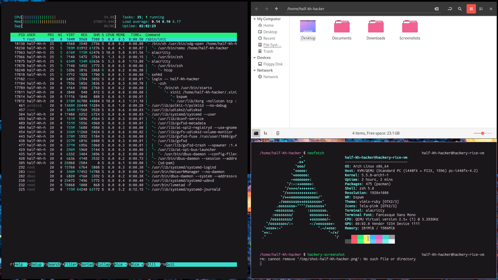

# dotfiles

Portable configurations for my computing setup.

I use [Arch Linux](https://archlinux.org/) and [bspwm](https://github.com/baskerville/bspwm).



## Usage

Dotfiles (except most of `_apps`) are managed with [GNU Stow](https://www.gnu.org/software/stow/).

```shell
$ stow zsh vim # Command-line configuration
$ stow fontconfig gtk # Global desktop settings
$ stow bspwm alacritty # bspwm configuration
```

You can use `stow -D` to uninstall dotfile packages, too.

## Requirements

- Fantasque Sans Mono
- Vimix GTK theme
- `vimix-cursors`
- Tela icon theme
